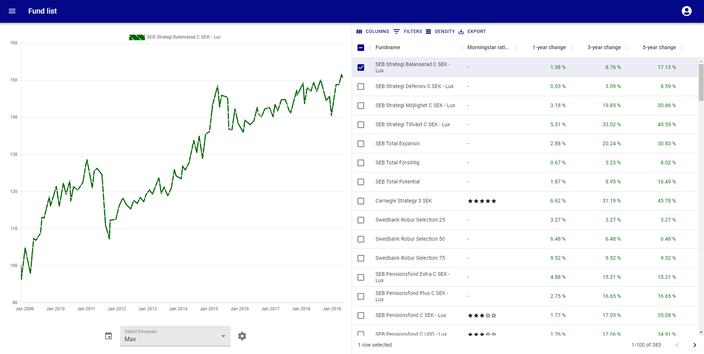

# Fund manager

[Besök projektet](https://fund-manager1.herokuapp.com/)

## Koncept

Fondkurser, förvaltning och rekommendationer med hög tillgänglighet. Hanterar inloggning och skapandet av nya användare och sköter autentisering med god webbsäkerhet.

## Teknologier

Next.js, React, Redux, MongoDB & Mongoose. Integrationstester med Jest och React Testing Library, E2E-tester med Cypress samt CI/CD-workflow med GitHub Actions.
